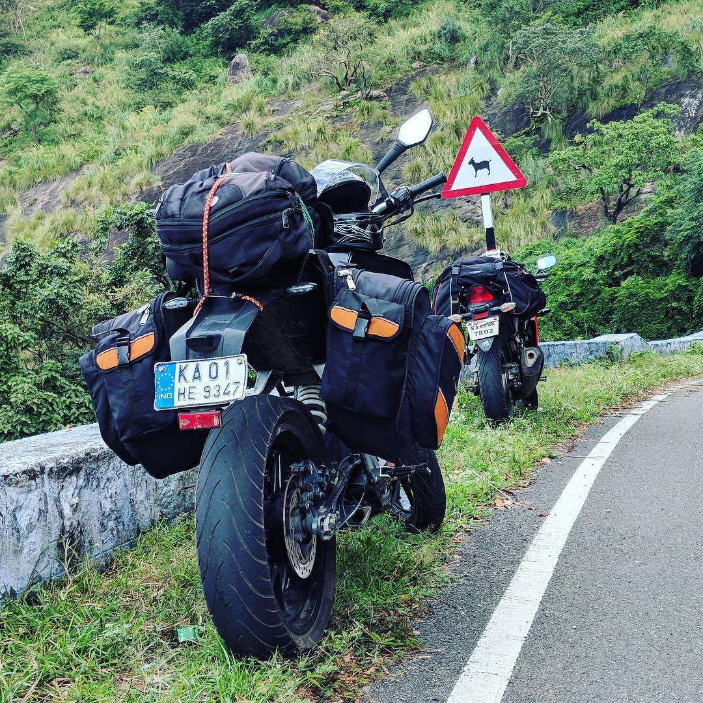

import { Link } from "gatsby"

Now that you have reached my site, lemme give you some insight about myself. I am a Full Stack Engineer based out of Bangalore, India
currently working at [Recruiterbox](http://recruiterbox.com/). I love solving complex problems by providing elegant solution.

Currently my tech stack includes [Django](https://www.djangoproject.com/) with [DRF](https://www.django-rest-framework.org/), [React](https://reactjs.org/) & Redux, AWS & [Docker](https://www.docker.com/). However, I like to fiddle with other technologies/languages
like [Spring Boot](https://spring.io/projects/spring-boot), [Kotlin](https://kotlinlang.org/), Shell-scripting, [React Native](https://reactnative.dev/), [Kubernetes](https://kubernetes.io/), [Firebase](https://firebase.google.com/) etc.

> _Whatever happens, you are bound to learn something new everyday!!!_

Apart from all of the above, I am an avid traveller & photographer who has a special love for motorcycles. Being a proud owner of [KTM Duke 200](https://www.ktm.com/in/naked/200-duke/), I have completed _60K+ Kms_.

I also have a pet named *_Lucy_*.

In case, you would like to collaborate and know more about me <Link to='/contact'>Hit Me Up</Link> !!!
