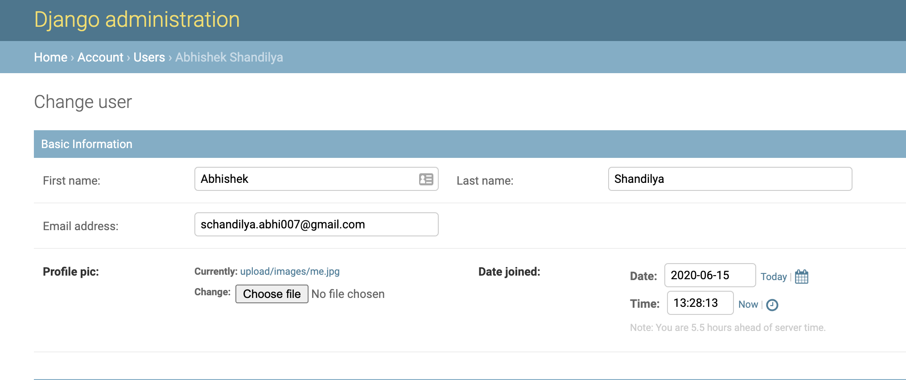
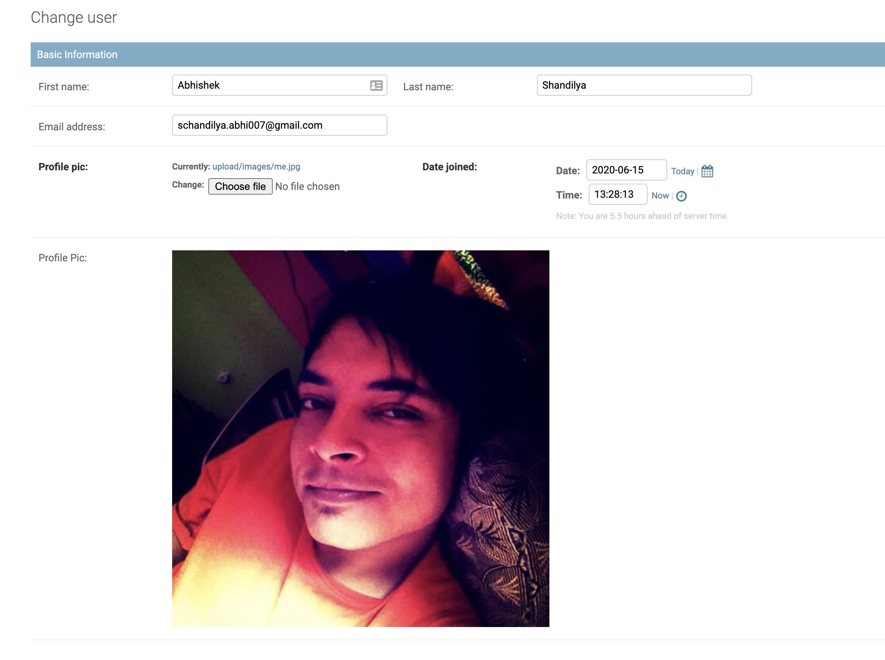

import { Link } from 'gatsby';
import CheckMark from '../../../common/emojis/CheckMark';
import CrossMark from '../../../common/emojis/CrossMark';
import Pencil from '../../../common/emojis/Pencil';


There is no denying the fact that we all love Django and most importantly __*Django Admin*__. It provides ready-to-use
interactive interface for CRUD operations with models along with tons of customizations and features like filters,
pagination, bulk-actions etc.


> One of the most powerful parts of Django is the automatic admin interface. It reads metadata from your models to
provide a quick, model-centric interface where trusted users can manage content on your site.
>
> <cite>&mdash; <a href='https://docs.djangoproject.com/en/3.0/ref/contrib/admin/#module-django.contrib.admin'>Django site</a></cite>

Wouldn't it be great if there was a way to display the actual image instead of just the boring link. Well, we are lucky
as there are plenty of methods to achieve this.

For ease of understanding and post's length this will be a 3 part post -
- Part 1: Using __*readonly_fields*__ <CheckMark />
- <Link to="/blog/part-2-show-images-in-django-admin">Part 2:</Link> Create custom widget for the field <CheckMark />
- Part 3: Create a Mixin to reuse the widget <CrossMark />

For this tutorial let's suppose we have a model as below -
```py
class User(AbstractUser):
    # Fields
    profile_pic = models.ImageField(upload_to="upload/images/")
```

By default, the django admin displays the link for *ImageField* along with a change button. Here I have an ImageField
named *"Profile Pic"* and it is displayed like this -



### <Pencil /> Using __*readonly_fields*__

Django admin provides __*readonly_fields*__ to allow fields to prevent them from editing. We can create a new method which
would return the image tag (```</img>```) with [mark_safe](https://docs.djangoproject.com/en/3.0/ref/utils/#django.utils.safestring.mark_safe)
which then could be used to display the actual image. Create a method as mentioned below in the ```User``` model.

```py
def get_profile_pic_tag(self):
    return mark_safe(''.format(
        url=self.profile_pic.url
    )
)
get_profile_pic_tag.short_description = "Profile Pic"
```

&#128161; *__Tip:__* This method can be created in your ModelAdmin as well. The only difference would be to replace
the self parameter with something else like obj or user and use obj.profile_pic.url instead of self.profile_pic.url

Now we can use the above method under the readonly_fields property as below -

```py
@admin.register(models.User)
class UserAdmin(admin.ModelAdmin):
    list_display = ('id', 'first_name', 'last_name', 'email', 'profile_pic',)
    readonly_fields = ('get_profile_pic_tag', )
    ...
```

And Voila!!! The actual image will be visible as below -



In the <Link to="/blog/part-2-show-images-in-django-admin">next</Link> part of this tutorial we will understand the cons
of using this approach and implement a fix for it.
