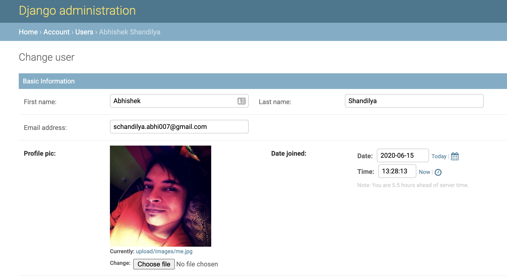

import { Link } from "gatsby";
import CheckMark from '../../../common/emojis/CheckMark';
import CrossMark from '../../../common/emojis/CrossMark';

This is continuation from the 2 part post series on *Show images in django admin* -
- <Link to="/blog/part-1-show-images-in-django-admin">Part 1:</Link> Using readonly_fields <CheckMark />
- Part 2: Create custom widget for the field <CheckMark />
- Part 3: Create a Mixin to reuse the widget <CrossMark />

In Part 1 of this tutorial we saw how to use __*readonly_fields*__ to show actual image but there are few cons with such
implementation -
- We do not have option to change the image from this field.
- We need to create method to return image tag for each field. So, the code is not scalable and doesn't follow the
[__*DRY*__](https://en.wikipedia.org/wiki/Don%27t_repeat_yourself) principle. Actually it's quite opposite.

### So what's the solution???
&#128161;Hint: We will override the underlying widget provided by <Link to="https://docs.djangoproject.com/en/3.0/ref/forms/widgets/"> Django!</Link>

> A widget is Django’s representation of an HTML input element. The widget handles the rendering of the HTML, and the extraction of data from a GET/POST dictionary that corresponds to the widget.
>
> <cite>&mdash; <Link to="https://docs.djangoproject.com/en/3.0/ref/forms/widgets/">
Django site</Link></cite>

&#128296;&#128296;&#128296; *Enough describing stuff, let's get our hands dirty.*

First let's create a new widget which is subclassed from Django's `AdminFileWidget` and override the `render` method which
is responsible for converting our widget to HTML code.

```py
from django.contrib.admin.widgets import AdminFileWidget
from django.utils.safestring import mark_safe

class AdminImageWidget(AdminFileWidget):
    def render(self, name, value, attrs=None, renderer=None):
        output = []
        if value and getattr(value, "url", None):
            image_url = value.url
            file_name = str(value)
            output.append(
                '<a href="{}" target="_blank"></a>'.
                    format(image_url, image_url, file_name))
        output.append(super().render(name, value, attrs))
        return mark_safe(u''.join(output))
```

Now to use this newly created widget we can override the `formfield_overrides` property of `ModelAdmin` and specify to
use this widget for the image fields -

```py
@admin.register(models.User)
class UserAdmin(admin.ModelAdmin):
    readonly_fields = ('get_profile_pic_tag', )
    formfield_overrides = {
        ImageField: {'widget': AdminImageWidget},
    }
```

&#128640; And this is the output -



As we can see, the existing `ImageField` field __*profile_pic*__ now shows the image preview and it can be changed as we
are not using the __*readonly*__ field.

> There is a caveat with this implementation. This method will show the preview for all the `ImageField` type of fields
from the model.

To solve this issue we can override the __*```formfield_for_dbfield```*__ method provided by ```ModelAdmin``` and apply
the widget to only the selected fields.

```py
def formfield_for_dbfield(self, db_field, **kwargs):
    if db_field.name == 'profile_pic':  # Add check for other fields if required
        request = kwargs.pop("request", None)
        kwargs['widget'] = AdminImageWidget
        return db_field.formfield(**kwargs)
    return super().formfield_for_dbfield(db_field, **kwargs)
```

However, overriding the method for all the admin models could be cumbersome and our code will become messy. Also,
 this method doesn't follow the DRY principle as mentioned earlier. In the next part of the tutorial we will see how we
 can reduce the complexity of the implementation and make our code follow the DRY approach.